# Social Network API

## Description

This application is an API that allows for the creation of users, the assignment of friends to users, thoughts (posts by users), and reactions (comments on thoughts).

## Installation

To install necessary dependencies, run the following command:

...

'npm i'
...

## Usage

To use this application, start the server by entering the command "node server.js", then you will be able to get all users or one user; add, edit, or delete a user; or add or delete a friend. You can also get all thoughts or one thought; add, edit, or delete a thought; or add or delete a reaction.

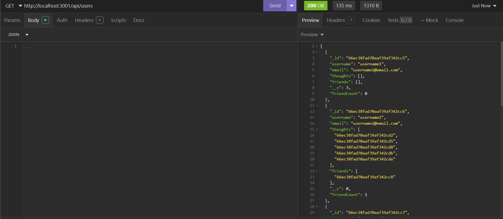
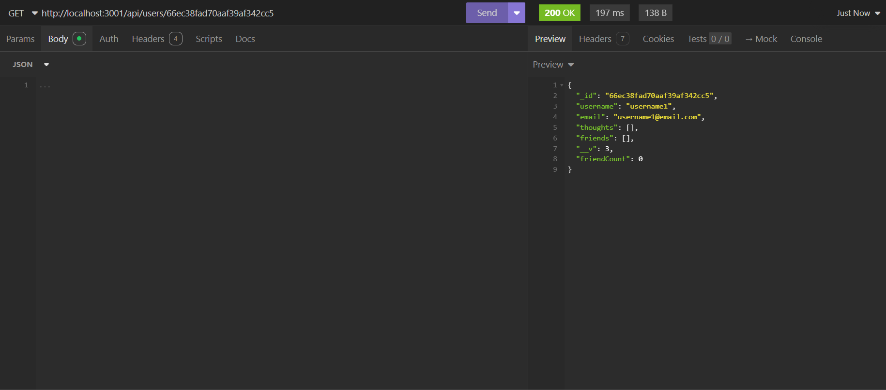
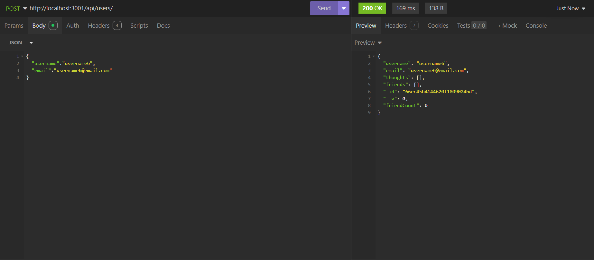
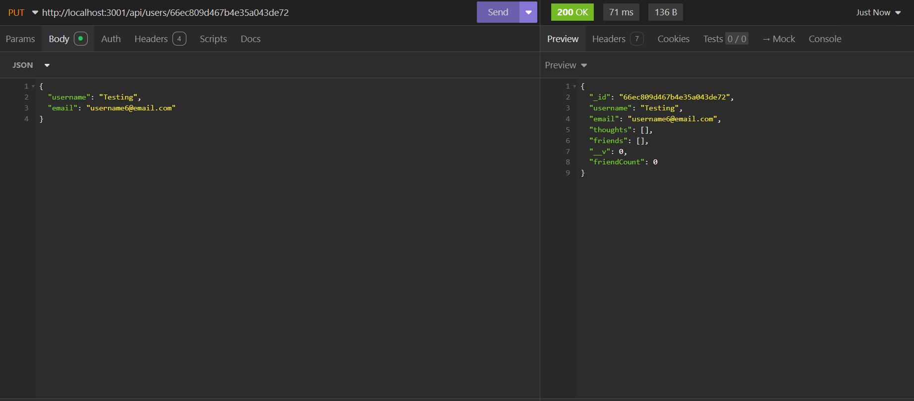
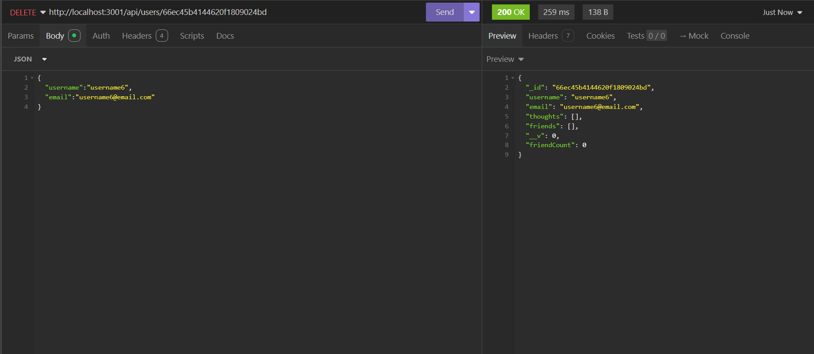
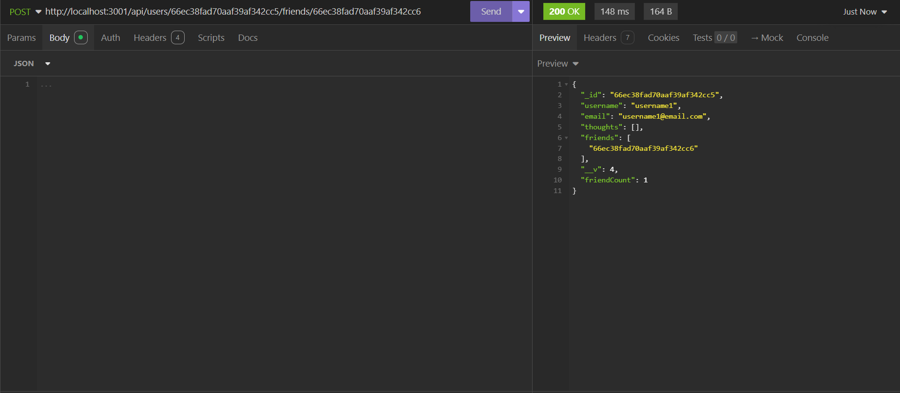
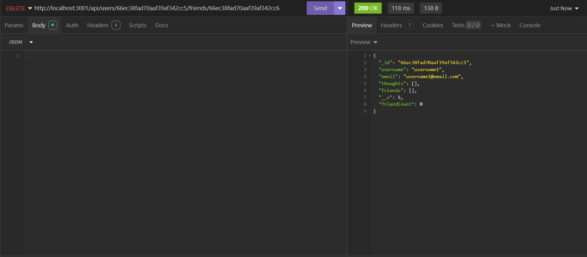
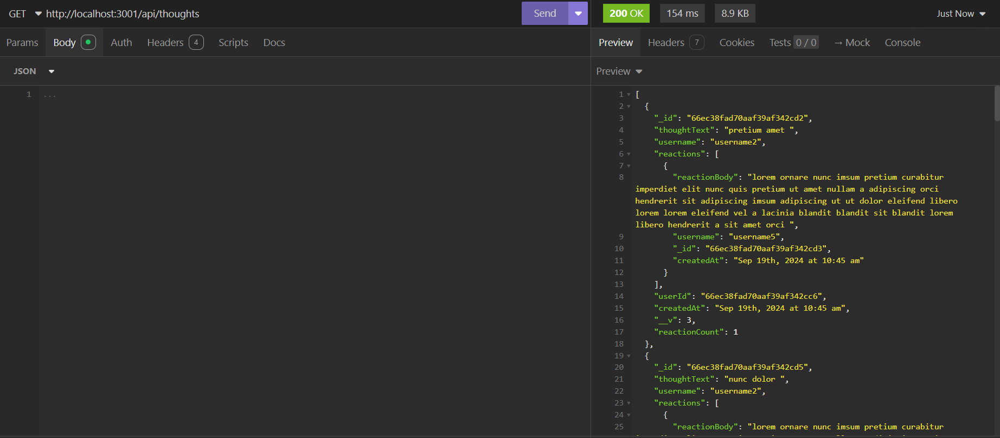
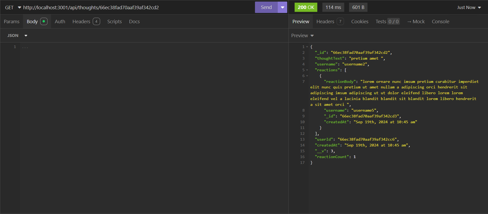
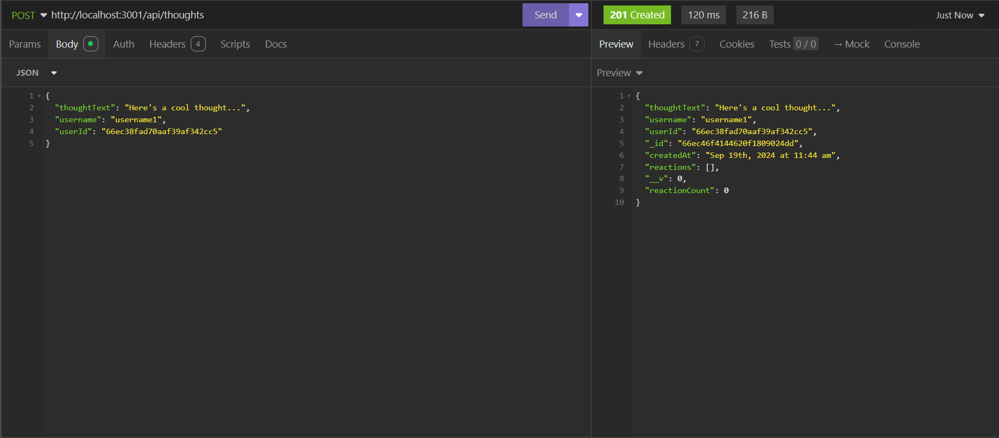
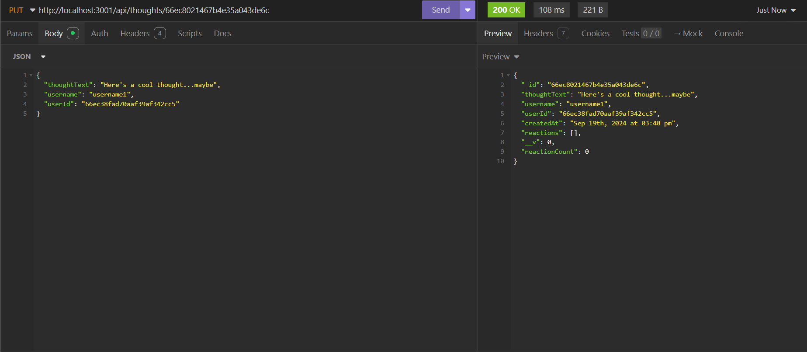
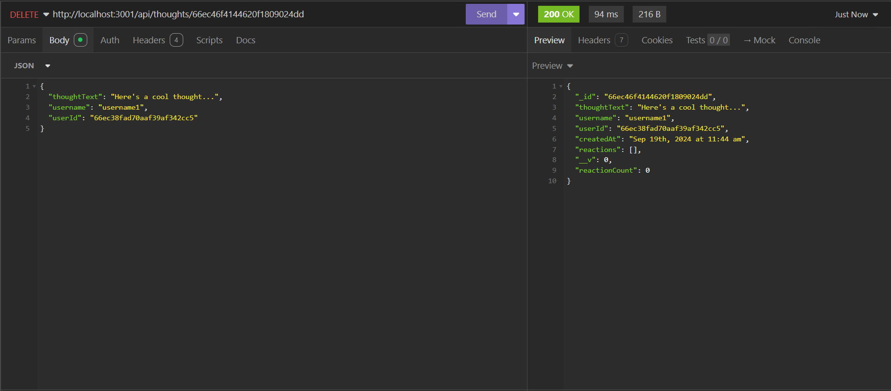
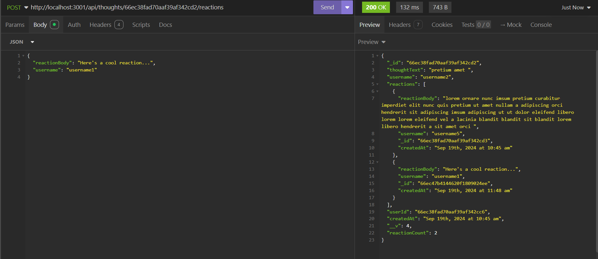
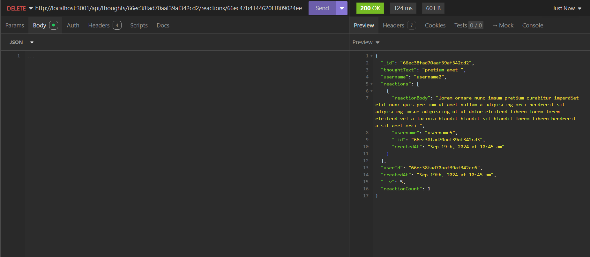

[Walkthrough](https://drive.google.com/file/d/1cxtF5McnGofmPEmHoU8tIVk32jnFbrA5/view?usp=sharing)

## Credits

N/A

## License

LICENSE in repo.
